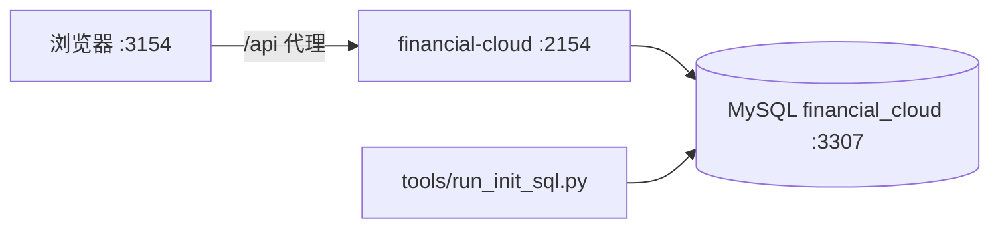

# 财务云 · financial-cloud

面向中小企业的 Web 财务记账系统。覆盖账套与科目、凭证与结账、薪资与日记账、三大报表与账簿分析、固定资产全生命周期，并提供经营仪表盘。

- **后端**：Spring Boot 4 + MyBatis-Plus，REST API 前缀 `/api`
- **前端**：Vue 3 + Vite + Pinia + Element Plus
- **数据库**：MySQL 9.7 LTS，库名 `financial_cloud`

---

## 功能概览

| 模块 | 能力 |
|------|------|
| 账套与科目 | 多账套、会计准则模板、科目树、期初余额、辅助核算 |
| 凭证 | 录入/修改/审核/过账、辅助核算、凭证模板、明细账 |
| 账簿 | 明细账、总账、科目余额表 |
| 报表 | 资产负债表、利润表、现金流量表（含间接法附表）、凭证汇总、费用明细 |
| 结账 | 月末结转、结账、损益结转、报表生成 |
| 薪资 | 员工档案、薪资计算、计提/发放凭证、个税与社保配置 |
| 日记账 | 账户、流水、月末汇总 |
| 固定资产 | 类别、卡片、计提折旧（直线/工作量/加速）、变动、折旧报表、导入导出 |
| 仪表盘 | 资金、应收、成本、利润等经营指标 |
| 系统 | JWT 登录、角色权限、系统配置、操作审计 |

---

## 架构



---

## 环境要求

| 工具 | 版本 |
|------|------|
| JDK | 17+（CI 使用 21） |
| Maven | 随 `financial-cloud/mvnw` |
| Node.js | 20+ |
| Docker | 本地 MySQL（可选，推荐） |
| Python | 3.10+（数据库初始化脚本） |

---

## 快速开始

### 1. 启动数据库

```bash
docker compose up -d
python tools/run_init_sql.py
```

默认连接 `127.0.0.1:3307`，库名 `financial_cloud`，应用用户见 [docker-compose.yml](docker-compose.yml)。

首次初始化后默认管理员：**admin / changeme**（首次启动由后端自动转为 bcrypt，登录后请立即修改）。

### 2. 启动后端

```bash
cd financial-cloud
./mvnw.cmd -DskipTests package    # Windows
# ./mvnw -DskipTests package      # Linux / macOS
java -jar target/financial-cloud-boot-1.1.0-ga.jar
```

服务地址：`http://localhost:2154`，健康检查 `GET /actuator/health`。

### 3. 启动前端

```bash
cd financial-cloud-ui
npm install
npm run dev
```

开发地址：`http://localhost:3154`（Vite 将 `/api` 代理到后端 2154）。

---

## 项目结构

```
.
├── financial-cloud/          # Spring Boot 后端
├── financial-cloud-ui/       # Vue 3 前端
├── sql/                      # Schema、种子数据、全量 init SQL
├── tools/                    # 数据库 init / 冒烟 / 维护脚本
├── docs/                     # 模块文档、测试用例、科目模板
├── docker-compose.yml        # 本地 MySQL
└── .github/workflows/ci.yml  # CI：单测 + Lint + E2E
```

---

## 开发说明

### 数据库

- 全量重建：`python tools/run_init_sql.py`
- 重新生成 init SQL：`python tools/import_standard_subjects.py` → `python tools/build_init_sql.py`
- 详见 [sql/README.md](sql/README.md)

修改 MySQL 连接：编辑 [financial-cloud/src/main/resources/application.yml](financial-cloud/src/main/resources/application.yml)。

### 后端

```bash
cd financial-cloud
./mvnw test                       # 单元测试
./mvnw -DskipTests package        # 打包
```

主要包结构：`controller` / `service` / `repository` / `domain` / `dto`（按业务域分子包）。

### 前端

```bash
cd financial-cloud-ui
npm run dev          # 开发
npm run build        # 生产构建
npm run lint         # ESLint
npm run typecheck    # TypeScript 检查
```

详见 [financial-cloud-ui/readme.md](financial-cloud-ui/readme.md)。

### 测试

```bash
# 后端单测
cd financial-cloud && ./mvnw test

# 前端 E2E（需后端 2154 + 前端 3154 已启动）
cd financial-cloud-ui
npm run test:e2e:install
npm run test:e2e
```

测试用例说明：[docs/testing/financial-cloud-voucher-report-test-cases.md](docs/testing/financial-cloud-voucher-report-test-cases.md)

---

## 文档

| 文档 | 说明 |
|------|------|
| [docs/README.md](docs/README.md) | 文档索引 |
| [docs/modules/fixed-assets.md](docs/modules/fixed-assets.md) | 固定资产 |
| [docs/modules/ledger-and-reports.md](docs/modules/ledger-and-reports.md) | 账簿与报表 |
| [docs/modules/platform.md](docs/modules/platform.md) | 认证与平台 |
| [docs/quality-dashboard.md](docs/quality-dashboard.md) | 质量快照 |

---

## 技术栈

### 后端

| 组件 | 版本 |
|------|------|
| Spring Boot | 4.1.1 |
| Java | 17 |
| MyBatis-Plus | 3.5.16 |
| MySQL Connector/J | 9.2.0 |
| Hutool | 5.8.36 |
| Caffeine | Token 黑名单缓存 |

### 前端

| 组件 | 版本 |
|------|------|
| Vue | 3.5 |
| Vite | 5.x |
| Pinia | 2.3 |
| Element Plus | 2.14 |
| ECharts | 5.6 |
| Playwright | E2E |

### 基础设施

| 组件 | 版本 |
|------|------|
| MySQL | 9.7 LTS |
| Docker Compose | 本地开发数据库 |

---

## 许可证

前端采用 [Apache-2.0](financial-cloud-ui/package.json)；后端许可证见各模块声明。
