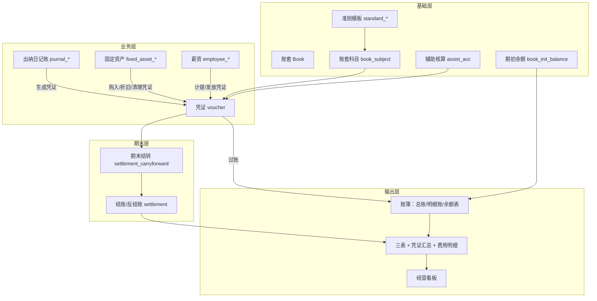
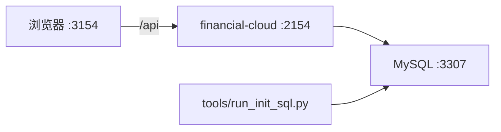

# 00 · 产品总览

> 现状基准文档 · 2026-09-03  
> 代码证据：`financial-cloud` + `financial-cloud-ui` + `sql/financial_cloud_init.sql`

## 1. 产品定位

财务云是一款面向**中小企业与代账场景**的 Web 财务记账系统，聚焦：

- 多账套做账闭环（凭证 → 账簿 → 结账 → 报表）
- 固定资产、出纳日记账、薪资等周边核算
- 经营仪表盘与基础权限管控

与外部《小微企业财务软件产品需求文档》相比：本仓库**已提前实现**薪资、日记账、反结账、准则模板等能力；往来已落地 L1+L2（余额/明细/对账/账龄），**核销 L3、账套备份恢复、资产盘点**等仍缺。详见 [20-gap-analysis.md](20-gap-analysis.md)。

## 2. 目标用户与角色

| 角色类型 | 典型用户 | 系统中的支撑 |
|----------|----------|--------------|
| 核心做账 | 行政兼财务、兼职财务、代账会计 | 凭证、账簿、结账、报表菜单；角色-资源权限 |
| 审核 | 财务负责人 | 账套参数 `voucherReviewed` 开启后的审核流 |
| 管理查看 | 法人 / 老板 | 首页经营看板（非独立「老板极简报表」页） |
| 系统管理 | 超级管理员 | 用户、角色、资源、账套授权、安全策略 |

权限模型：`roles` + `permission`（角色-资源）+ `permission_book`（用户-账套）。前端按钮级指令 `v-hasPermi` 已实现，视图中使用较少，实际以**菜单是否下发**为主。

## 3. 模块架构



### 标准做账闭环（已实现主路径）

```
新建/初始化账套 → 科目与期初 → 日常凭证（或日记账/资产/薪资生成凭证）
  → 审核（可选）→ 过账 → 期末结转 → 结账 → 查账簿/报表 →（可选）反结账
```

## 4. 技术架构与部署

| 层 | 技术 | 端口 / 说明 |
|----|------|-------------|
| 前端 | Vue 3.5 + Vite 6 + Pinia + Element Plus | 开发 `:3154`，`/api` 代理到后端 |
| 后端 | Spring Boot + MyBatis-Plus | `:2154`，REST 前缀 `/api` |
| 数据库 | MySQL 9.7（Docker Compose） | `:3307`，库 `financial_cloud` |
| 认证 | 自研 JWT + Session 拦截器 | 非完整 Spring Security Filter Chain |



- **无独立网关 / 无前后端 Dockerfile**；生产前端一般为 `dist` + Nginx 反代。
- 默认账号：`admin` / `changeme`（首次启动 bcrypt 迁移，登录后应修改）。
- 详细技术说明见 [../modules/platform.md](../modules/platform.md)。

## 5. 多账套与隔离机制

系统采用**双层隔离**：

| 层级 | 载体 | 机制 |
|------|------|------|
| 机构 Institution | 表 `institutions` | `WebHttpInstRequestFilter` 按 Host 解析；前端 [views/config/institutions.vue](../../financial-cloud-ui/src/views/config/institutions.vue) 配置品牌信息 |
| 账套 Book | 业务表 `book_id` | Service 层按当前用户 `bookId` 过滤；切换接口 `GET /api/users/switchBook/{bookId}` |

**定性（现状）**：机构层为**单部署品牌/域名配置 + 租户骨架**，**不是**完整 SaaS 多租户注册与计费体系。代账场景主要依赖「一用户多账套授权」（`permission_book`）。

用户上下文：

- `userinfo.book_id`：当前选中账套
- JWT / Session 同步 `bookId`
- 顶栏 [Navbar.vue](../../financial-cloud-ui/src/layout/components/Navbar.vue)：账套下拉 + 当前账期展示

## 6. 布局与导航

经典财务后台布局（与 PRD 规范一致）：

- **顶栏**：账套切换、当前会计期间、用户菜单
- **侧栏**：后端菜单 `GET /open/func/list` 动态生成（`resources` 表）
- **主区**：业务页 + TagsView 多页签

静态路由（登录、onboarding、个人中心等）见 [router/index.ts](../../financial-cloud-ui/src/router/index.ts)；业务菜单由种子 SQL 驱动。

## 7. 首页工作台

路由：`/` → [views/index.vue](../../financial-cloud-ui/src/views/index.vue)  
数据：`FundDashboardController` / `DashboardController`（`/api/statistics/*`、`/api/dashboard`）

### 已实现：8 个经营卡片

| 组件 | 指标 |
|------|------|
| `fund_balance` | 货币资金余额 |
| `receivable` | 应收 / 应付概览与周转 |
| `expected_available_funds` | 预计可用资金 |
| `net_profit` | 净利润 |
| `revenue_cost` | 收入成本 |
| `cost` | 费用 |
| `added_tax` | 增值税相关 |
| `other_subjects` | 其他科目 |

### 未实现（相对 PRD）

- 待办任务区（待审核凭证、待计提折旧、待结账、到期往来）
- 独立「老板极简报表」页（首页卡片**部分承接**经营可视化，是否单列待产品确认）

## 8. 实现总览（对照 PRD 八大模块）

| PRD 模块 | 现状结论 | 分册 |
|----------|----------|------|
| 账套管理 | **部分实现**（无封存/作废/备份） | [01](01-account-book.md) |
| 基础设置 | **已实现**（含准则模板，超出 PRD） | [02](02-basic-settings.md) |
| 凭证管理 | **部分实现**（核心闭环可用；附件/同人审核/经典打印接入缺失） | [03](03-voucher.md) |
| 账簿管理 | **部分实现**（无多栏账/数量金额账；溯源不完整） | [04](04-ledger.md) |
| 固定资产 | **部分实现**（无盘点；购入凭证有条件） | [07](07-fixed-asset.md) |
| 往来管理 | **已实现 L1+L2**（核销 L3 未做） | [11](11-arap.md) / [20](20-gap-analysis.md) |
| 报表管理 | **部分实现**（三表+费用明细；Excel 为主；无 PDF/老板报表） | [05](05-statement.md) |
| 系统管理 | **部分实现**（日志不全、无业务操作留痕） | [10](10-system-admin.md) |

### PRD 未列但已实现的能力

| 能力 | 分册 |
|------|------|
| 出纳日记账 | [08](08-cashier-journal.md) |
| 薪资与个税 | [09](09-payroll.md) |
| 反结账 | [06](06-settlement.md) |
| 准则模板双套 | [02](02-basic-settings.md) |

## 9. 规模与质量快照

| 项 | 约数 / 说明 |
|----|-------------|
| 后端 Controller | ~68 |
| 领域实体 / 业务表 | ~68 实体 / 62+ 表 |
| 前端页面 | ~108 个 `.vue`（含 IAM/审计） |
| E2E | Playwright，约 40 个 spec（凭证、结账、报表 golden 等） |
| OpenSpec | 已完成：反结账、凭证工作台；待做：本月账本包 |

## 10. 相关链接

- 仓库说明：[../../README.md](../../README.md)
- 差距清单：[20-gap-analysis.md](20-gap-analysis.md)
- 迭代路线：[21-roadmap.md](21-roadmap.md)
