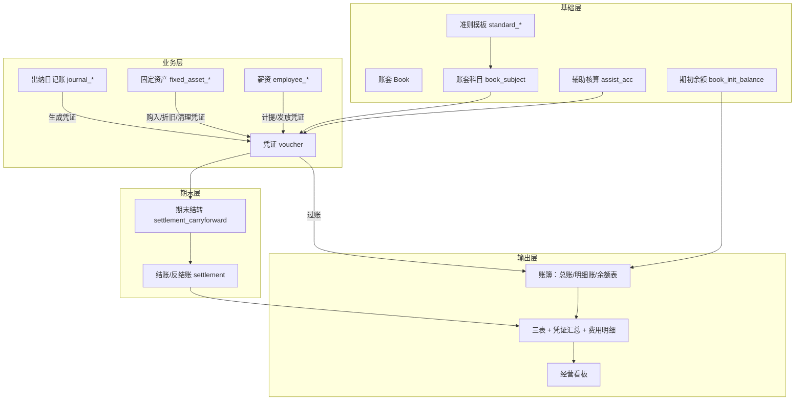
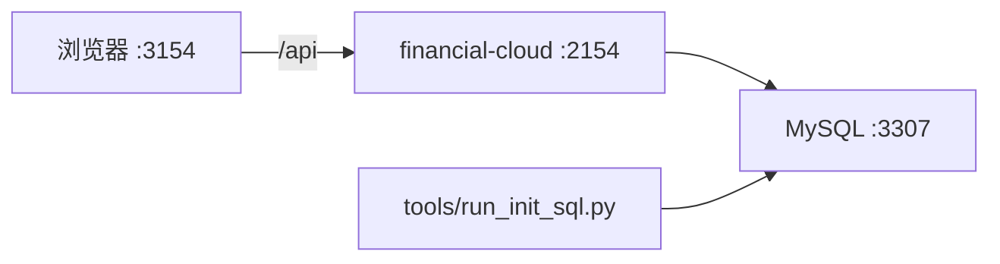

# 00 · 产品总览

> 当前成熟度（2026-10-02）：主要功能已实现，正在进行稳定性与会计试用验收。自动测试通过不替代真实账期试用与人工签字。下一阶段优先账务可信和做账主流程，见 [操作手册](22-accountant-quick-start.md) 与 [独立验收包](../testing/accounting-acceptance.md)。

> 当前五阶段迭代顺序、门槛与优先级待办见 [自主迭代路线](23-self-iteration-roadmap.md)。

> 现状基准文档 · 2026-09-29  
> 代码证据：`financial-cloud` + `financial-cloud-ui` + `sql/financial_cloud_init.sql`

## 1. 产品定位

财务云是一款面向**中小企业与代账场景**的 Web 财务记账系统，聚焦：

- 多账套做账闭环（凭证 → 账簿 → 结账 → 报表）
- 固定资产、出纳日记账、薪资等周边核算
- 经营仪表盘与基础权限管控

与外部《小微企业财务软件产品需求文档》相比：本仓库**已提前实现**薪资、日记账、反结账、准则模板等能力；往来 L1–L3、账套备份/恢复、资产盘点（含盘盈入账）、打印/服务端 PDF、吞吐 V2 与 Post-V2 改证路径均已收口。详见 [20-gap-analysis.md](20-gap-analysis.md)。

## 2. 目标用户与角色

| 角色 | 典型用户 | 菜单范围（摘要） |
|------|----------|------------------|
| 管理员 | 账套所有者 / 协作管理员 | 业务全模块 + 基础设置 + 系统设置（账套/角色等） |
| 做账员 | 行政兼财务、兼职财务、代账会计 | 凭证/账簿/报表/出纳/资产/薪资/往来 + 账套管理（不含系统参数）；无结账 |
| 审核员 | 财务负责人 | 做账员范围 + 结账/反结账；可审凭证 |
| 查看员 | 法人/老板/只读同事 | 仪表盘、凭证（只读）、账簿、报表、往来 |

权限模型：开放注册；`permission_book` + 账套级 `role_member`。用户自助注册后可建账并成为该账套管理员；在账套管理中邀请其他注册用户并选择产品角色。侧栏「基础设置」（原准则管理）含会计准则模板与初始余额/辅助核算/现金流量配置、凭证与结账参数；「系统设置」含账套管理、系统参数、角色管理。旧系统设置与日志审计菜单已隐藏。**菜单可见 ≠ 接口可调**：业务写操作与敏感管理接口由后端 `ProductRoles` / 账套管理员校验强制拒绝；前端 `v-hasRole` 仅作辅助。无有效账套或无产品角色时角色解析 fail-closed，前端导向 `/no-access`。

## 3. 模块架构


```mermaid
flowchart TB
  subgraph found [基础层]
    Book["账套 Book"]
    Std["准则模板 standard_*"]
    Subj["账套科目 book_subject"]
    Assist["辅助核算 assist_acc"]
    Init["期初余额 book_init_balance"]
  end
  subgraph biz [业务层]
    Voucher["凭证 voucher"]
    Journal["出纳日记账 journal_*"]
    Asset["固定资产 fixed_asset_*"]
    Payroll["薪资 employee_*"]
  end
  subgraph close [期末层]
    Carry["期末结转 settlement_carryforward"]
    Settle["结账/反结账 settlement"]
  end
  subgraph out [输出层]
    Ledger["账簿：总账/明细账/余额表"]
    Report["三表 + 凭证汇总 + 费用明细"]
    Dash["经营看板"]
  end
  Std --> Subj --> Voucher
  Assist --> Voucher
  Init --> Ledger
  Journal -->|生成凭证| Voucher
  Asset -->|购入/折旧/清理凭证| Voucher
  Payroll -->|计提/发放凭证| Voucher
  Voucher -->|过账| Ledger
  Voucher --> Carry --> Settle
  Settle --> Report
  Ledger --> Report --> Dash
```

### 标准做账闭环（已实现主路径）

```
新建/初始化账套 → 科目与期初 → 日常凭证（或日记账/资产/薪资生成凭证）
  → 审核（可选）→ 过账 → 期末结转 → 结账 → 查账簿/报表 →（可选）反结账
```

## 4. 技术架构与部署

| 层 | 技术 | 端口 / 说明 |
|----|------|-------------|
| 前端 | Vue 3.5 + Vite 6 + Pinia + Element Plus | 开发 `:3154`，`/api` 代理到后端 |
| 后端 | Spring Boot + MyBatis-Plus | `:2154`，REST 前缀 `/api` |
| 数据库 | MySQL 9.7（Docker Compose） | `:3307`，库 `financial_cloud` |
| 认证 | 自研 JWT + Session 拦截器 | 非完整 Spring Security Filter Chain |


```mermaid
flowchart LR
  Browser["浏览器 :3154"] -->|"/api"| Backend["financial-cloud :2154"]
  Backend --> MySQL["MySQL :3307"]
  Init["tools/run_init_sql.py"] --> MySQL
```

- **无独立网关 / 无前后端 Dockerfile**；生产前端一般为 `dist` + Nginx 反代。
- 默认账号：`admin` / `changeme`（首次启动 bcrypt 迁移，登录后应修改）。
- 详细技术说明见 [../modules/platform.md](../modules/platform.md)。

## 5. 多账套与隔离机制

系统采用**双层隔离**：

| 层级 | 载体 | 机制 |
|------|------|------|
| 机构 Institution | 表 `institutions` | `WebHttpInstRequestFilter` 按 Host 解析；前端 [views/config/institutions.vue](../../financial-cloud-ui/src/views/config/institutions.vue) 配置品牌信息 |
| 账套 Book | 业务表 `book_id` | Service 层按当前用户 `bookId` 过滤；切换接口 `GET /api/users/switchBook/{bookId}` |

**定性（现状）**：机构层为**单部署品牌/域名配置 + 租户骨架**，**不是**完整 SaaS 多租户注册与计费体系。代账场景主要依赖「一用户多账套授权」（`permission_book`）。

用户上下文：

- `userinfo.book_id`：当前选中账套
- JWT / Session 同步 `bookId`
- 顶栏 [Navbar.vue](../../financial-cloud-ui/src/layout/components/Navbar.vue)：账套下拉 + 当前账期展示

## 6. 布局与导航

经典财务后台布局（与 PRD 规范一致）：

- **顶栏**：账套切换、当前会计期间、用户菜单
- **侧栏**：后端菜单 `GET /open/func/list` 动态生成（`resources` 表）
- **主区**：业务页 + TagsView 多页签

静态路由（登录、onboarding、个人中心等）见 [router/index.ts](../../financial-cloud-ui/src/router/index.ts)；业务菜单由种子 SQL 驱动。

## 7. 首页工作台

路由：`/` → [views/index.vue](../../financial-cloud-ui/src/views/index.vue)  
数据：`FundDashboardController` / `DashboardController`（`/api/statistics/*`、`/api/dashboard`）

### 已实现：8 个经营卡片

| 组件 | 指标 |
|------|------|
| `fund_balance` | 货币资金余额 |
| `receivable` | 应收 / 应付概览与周转 |
| `expected_available_funds` | 预计可用资金 |
| `net_profit` | 净利润 |
| `revenue_cost` | 收入成本 |
| `cost` | 费用 |
| `added_tax` | 增值税相关 |
| `other_subjects` | 其他科目 |

### 下一阶段（近端主轴已收口）

- ~~独立「老板极简报表」页~~ → **已由首页看板承接**（不做第二页）
- ~~盘盈入账~~ → **已落地**（`surplusPreview` / `bookSurplus`，见 [07](07-fixed-asset.md)、[20](20-gap-analysis.md) §5.5）
- ~~参数配置独立页~~ → **已落地**（`views/config/voucher-settlement.vue`，见 [20](20-gap-analysis.md) §2.4）
- ~~代账吞吐 V2 + Post-V2 改证路径~~ → **已收口**（见 [V2](../superpowers/specs/2026-09-29-daizhang-throughput-v2-design.md) / [Post-V2](../superpowers/specs/2026-09-29-daizhang-post-v2-design.md)；交付 [#5](https://github.com/flydmonkey/financial-cloud/pull/5)）
- ~~代账工作台（多账套月末看板）~~ → **已收口**（见 [books-board 设计](../superpowers/specs/2026-09-29-daizhang-books-board-design.md) / [收口 backlog](../superpowers/plans/2026-09-29-books-board-backlog.md)；交付 [#6](https://github.com/flydmonkey/financial-cloud/pull/6)）
- 近端不以 PRD 新模块扩容为主；增强项按客户声音排期
- **明确不做跨账套结账**：不提供跨账套一键/批量结账、批量过账，也不做「跨套结账就绪软报告」类聚合写路径准备；结账始终在单账套内完成。代账工作台仅负责跨套进度一览、进入单套处理、已结账本包导出
- Non-goal 不变：工资条员工自助、税局直连、移动端/AI、银行余额调节增强、税费向导增强

## 8. 实现总览（对照 PRD 八大模块）

| PRD 模块 | 现状结论 | 分册 |
|----------|----------|------|
| 账套管理 | **已实现**（封存/手动+定时备份/覆盖恢复/有数据禁硬删） | [01](01-account-book.md) |
| 基础设置 | **已实现**（含准则模板，超出 PRD） | [02](02-basic-settings.md) |
| 凭证管理 | **已实现**（核心闭环 + 经典打印单张/批量） | [03](03-voucher.md) |
| 账簿管理 | **已实现**（含多栏/数量金额账；服务端 PDF 全覆盖主账簿） | [04](04-ledger.md) |
| 固定资产 | **已实现**（含盘点含盘盈入账、首页规模卡；购入凭证有条件） | [07](07-fixed-asset.md) |
| 往来管理 | **已实现 L1+L2+L3** | [11](11-arap.md) / [20](20-gap-analysis.md) |
| 报表管理 | **已实现**（三表+下钻+打印；服务端 PDF 主表齐全；老板视图=首页） | [05](05-statement.md) |
| 系统管理 | **已实现**（含业务操作审计） | [10](10-system-admin.md) |

### PRD 未列但已实现的能力

| 能力 | 分册 |
|------|------|
| 出纳日记账 | [08](08-cashier-journal.md) |
| 薪资与个税 | [09](09-payroll.md) |
| 反结账 | [06](06-settlement.md) |
| 准则模板双套 | [02](02-basic-settings.md) |
| 代账工作台（多账套月末看板） | `/workspace/books-board`；见 [books-board 设计](../superpowers/specs/2026-09-29-daizhang-books-board-design.md) |

## 9. 规模与质量快照

| 项 | 约数 / 说明 |
|----|-------------|
| 后端 Controller | ~68 |
| 领域实体 / 业务表 | ~68 实体 / 62+ 表 |
| 前端页面 | ~108 个 `.vue`（含 IAM/审计） |
| E2E | Playwright，约 40 个 spec（凭证、结账、报表 golden 等） |
| OpenSpec | 已完成：反结账、凭证工作台、账本包、备份恢复、打印收口（`print-delivery-polish`） |

## 10. 相关链接

- 仓库说明：[../../README.md](../../README.md)
- 差距清单：[20-gap-analysis.md](20-gap-analysis.md)
- 迭代路线：[21-roadmap.md](21-roadmap.md)
