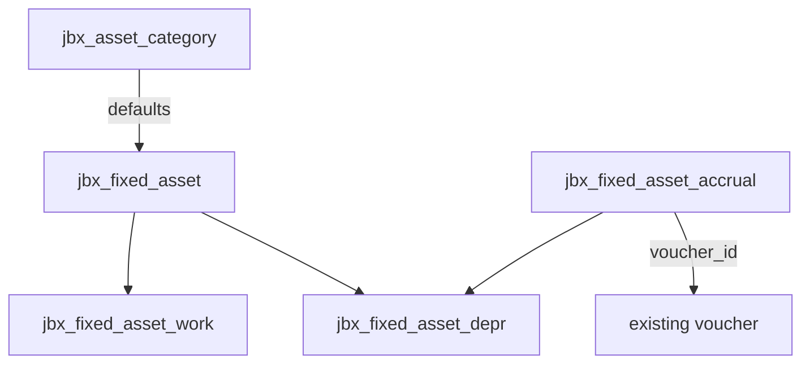
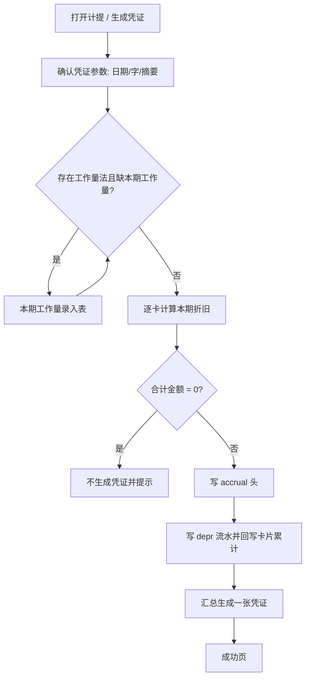

# 固定资产（第一期）— 设计说明

日期：2026-08-28  
状态：Phase 1 已实现（工作区未提交；需执行 `python tools/apply_fixed_asset.py` 应用表与菜单）  
范围：jinbooks Phase 1 — 资产类别 + 资产卡片 + 折旧凭证（本期计提）  
表名：与库惯例对齐为 `asset_category` / `fixed_asset` / `fixed_asset_work` / `fixed_asset_depr` / `fixed_asset_accrual`（无 jbx_ 前缀）

## 一、已确认决策

| # | 项 | 选择 |
|---|-----|------|
| 1 | 第一期范围 | **资产类别 + 卡片 + 折旧凭证**（能本期计提并生成凭证） |
| 2 | 折旧方法 | **平均年限法（直线法）+ 工作量法** |
| 3 | 工作量录入 | 计提前 **本期工作量录入表**（按资产填本期量） |
| 4 | 凭证组织 | **一期一张汇总凭证**：借方按折旧费用科目（及部门）汇总，贷方按累计折旧科目汇总 |
| 5 | 起提时点 | **当月增加当月不提、次月提** |
| 6 | 减少/清理时点 | **当月减少当月照提、次月停** |
| 7 | 卡片能力 | **增删改查 + 清理（改状态停提）**；不做复制/导入导出/购入清理业务凭证 |
| 8 | 重提 | 未审核/未过账 → 删旧凭证并重算重生成；已审核或已过账 → 禁止 |
| 9 | 计算字段变更 | 资产一旦有过任意一期计提，原值/期数或总工作量/残值率/方法 **只读**（变动单二期） |
| 10 | 实现路径 | **领域表 + 期间折旧流水**（类别/卡片/工作量/depr 明细/accrual 头） |
| 11 | 生成凭证 | 复用现有 `VoucherService.save(VoucherChangeDto)`（对齐薪资结转模式） |
| 12 | 期间 | 账套 `termCurrent`（`yyyy-MM`），不另起期间体系 |
| 13 | 部门 | 复用 HR `idm/dept` 树选 |
| 14 | 菜单 | 顶级「固定资产」：卡片、资产类别、计提折旧；明细/汇总/变动记录 **第一期不挂菜单** |

## 二、背景与目标

### 2.1 背景

仓库仅有科目/报表层面的固定资产与累计折旧（标准科目、资产负债表净值、现金流量表折旧行、`jt_zj` 计提折旧模板、结账 checklist 文案），**没有**资产卡片、类别、自动折旧引擎与折旧凭证生成。

### 2.2 目标

1. 维护资产类别（折旧默认值与默认科目）  
2. 维护资产卡片，按规则计算可提折旧  
3. 按会计期间计提折旧，生成一张汇总凭证，支持安全重提  
4. 落期间折旧流水，供二期明细表/汇总表只读接入  

### 2.3 非目标（第一期）

- 折旧明细表 / 折旧汇总表 UI  
- 资产变动记录 UI 与变动单驱动重算  
- 双倍余额递减法、年数总和法  
- 卡片复制、导入/导出  
- 购入凭证、完整清理/处置损益凭证  
- 更新改造转入在建工程的完整流转  
- 从采购单据自动归集入账原值  

---

## 三、模块边界与数据模型

### 3.1 包与入口

- 后端：`domain/fixedasset`、`service/fixedasset`、`controller/fixedasset`、`util/FixedAssetDepreciationRules`  
- API 前缀：`/api/fixed-asset/...`  
- 前端：`financial-cloud-ui/src/views/fixed-asset/` + `api/fixed-asset/`  
- 菜单 seed：`sql/seed/fixed_asset_menu.sql`（幂等）  

### 3.2 表结构（均含 `book_id`）

#### `jbx_asset_category`（资产类别）

| 字段 | 说明 |
|------|------|
| code / name | 账套内编码唯一 |
| depreciation_method | `STRAIGHT_LINE` / `UNITS_OF_PRODUCTION` |
| useful_life_years / useful_life_months | 年录入，月=年×12（或可编辑月） |
| residual_rate | 预计净残值率 % |
| fixed_asset_subject_id | 默认固定资产科目 |
| accum_depr_subject_id | 默认累计折旧科目 |
| remark | 备注 |

#### `jbx_fixed_asset`（资产卡片）

**基本信息**：code、name、category_id、dept_id、start_use_date、entry_period、quantity、spec、location、user_id、status（`IN_USE` / `DISPOSED`）、disposed_period（清理所属期，可空）

**折旧**：depreciation_method、useful_life_months（直线法）、expected_total_work（工作量法）、residual_rate、original_value、tax_amount、impairment、depreciated_periods、opening_accum_depr

**科目**：固定资产、购入对方、税金、累计折旧、折旧费用、资产清理、减值准备、减值对方（第一期计提只用 **折旧费用 + 累计折旧**）

**派生（可算可不落库）**：预计残值、期初净值、月折旧（直线法展示）、本年已折旧、期末累计折旧、期末净值

#### `jbx_fixed_asset_work`（本期工作量）

- 唯一键：`(book_id, asset_id, year_period)`  
- 字段：period_work  

#### `jbx_fixed_asset_depr`（期间折旧明细流水）

- 唯一键：`(book_id, asset_id, year_period)`  
- 字段：depr_amount、expense_subject_id、accum_depr_subject_id、dept_id、method、period_work（可空）、accrual_id  

#### `jbx_fixed_asset_accrual`（本期计提头）

- 唯一键：`(book_id, year_period)`  
- 字段：voucher_date、voucher_word、summary、voucher_id、total_amount、status  



---

## 四、计提规则（引擎硬约束）

实现于 `FixedAssetDepreciationRules`，必须有单测覆盖。

### 4.1 入账与四要素

- 入账价值以卡片 **原值** 为准（含后续资本化增加由二期变动单处理；第一期计提后原值只读）  
- 预计净残值 = 原值 × 残值率（两位小数）  
- 预计使用期数以 **月** 为引擎单位  
- 方法：直线法 / 工作量法  

### 4.2 公式

**直线法**

```
月折旧额 = (原值 − 预计净残值) ÷ 预计使用月份
```

（与「年折旧÷12」等价；引擎统一按月，避免年/月换算误差。）

**工作量法**

```
单位工作量折旧额 = (原值 − 预计净残值) ÷ 预计总工作量
本期折旧额 = 本期实际工作量 × 单位工作量折旧额
```

### 4.3 时点与边界

1. **增加**：开始使用日期所属会计期 **不提**，从 **次月** 起提。  
2. **清理**：`disposed_period` 所属期 **仍提**，从 **次月** 起停。  
3. **上限**：本期可提 ≤ `原值 − 减值准备 − 预计净残值 − 已累计折旧`；≤0 则本期 0。  
4. **精度**：金额 **两位小数**；触及上限或最后一期时 **补差提足**（剩余应提一次性计入本期）。  
5. **范围**：`DISPOSED` 且已过清理次月、已提足 → 不提；工作量法缺本期工作量 → **整批计提失败**。  
6. **归集**：按卡片折旧费用科目 + 使用部门汇总借方；按累计折旧科目汇总贷方。  
7. **计算字段锁**：该资产存在任意 `jbx_fixed_asset_depr` 行后，原值/期数或总工作量/残值率/方法不可改。  

### 4.4 第一期不做的规则（附录，二期+）

- 双倍余额递减（含最后两年转直线）、年数总和  
- 变动单：原值增减、年限/残值/方法变更、减值后重算剩余寿命  
- 更新改造暂停计提的完整业务状态机  
- 处置损益 = 处置收入 − 账面价值 − 清理费用 及对应凭证  

---

## 五、计提与重提流程



**重提**

1. 查本期 `accrual` 与关联 `voucher`  
2. 已审核或已过账 → 拒绝  
3. 否则：删凭证 → 删本期 `depr` → 回滚卡片累计/已折旧期数 → 再走计提流程  

**事务**：accrual、depr、卡片回写、`VoucherService.save` 同一事务；失败全回滚。

---

## 六、API 草图

| 区域 | 端点（示意） |
|------|----------------|
| 类别 | `GET/POST/PUT/DELETE /api/fixed-asset/category/...`（`/fetch` `/save` `/update` `/delete`） |
| 卡片 | `/api/fixed-asset/card/...` + `POST .../dispose` |
| 工作量 | `GET/PUT /api/fixed-asset/depreciation/work` |
| 计提 | `GET .../depreciation/status`、`GET/PUT .../params`、`POST .../accrue` |
| 权限 | 随菜单 resource/permission seed |

`bookId` 由 `@CurrentUser` / 当前账套注入，与现有模块一致。

---

## 七、前端页面

| 页面 | 说明 |
|------|------|
| 资产类别 | 列表 + 新增/编辑弹窗（对齐截图字段） |
| 卡片列表 | 当前期、过滤、显示已清理、按类别/部门侧栏、合计行；入口：新增、生成凭证、清理 |
| 卡片详情 | 五段：基本信息、折旧方法、原值净值累计、凭证科目、备注；状态章；计算字段只读规则 |
| 工作量录入 | 仅本期需填的工作量法在用资产 |
| 凭证参数 | 凭证日期、凭证字、摘要（默认「计提折旧费用」） |
| 计提成功页 | 凭证号链接、计提金额、重新计提；「查看折旧明细」二期，第一期可跳转卡片列表或隐藏 |

UI 风格对齐现有 Element Plus 后台（`app-container` / `el-card` / 表格），不另起视觉体系。

---

## 八、错误处理

| 场景 | 行为 |
|------|------|
| 工作量法缺本期工作量 | 整批失败，列出资产编码 |
| 本期凭证已审核/已过账 | 禁止重提 |
| 可提合计为 0 | 不生成凭证，提示本期无需计提 |
| 类别仍被卡片引用 | 禁止删类别 |
| 卡片已有 depr 流水 | 禁止删卡片 |
| 科目缺失或非末级 | 保存/计提失败 |
| 类别或卡片编码重复 | 保存失败 |

---

## 九、测试要点

**Rules 单测**

- 直线法常规月额、最后一期补差、上限为 0  
- 次月起提；清理当月仍提、次月停  
- 工作量法计算；缺工作量由服务层拒绝  
- 已存在 depr 后计算字段变更被拒绝  

**服务/API**

- 类别 CRUD；卡片 CRUD + dispose  
- 计提：凭证借贷平衡、按费用科目汇总  
- 重提：未过账成功；已过账拒绝  

---

## 十、二期衔接

| 能力 | 依赖 |
|------|------|
| 折旧明细表 / 汇总表 | 只读 `jbx_fixed_asset_depr` + 卡片维度 |
| 资产变动记录 | 变动单改计算字段并前瞻重算；解除第一期只读锁的替代路径 |
| 加速折旧 | 扩展 method 枚举与 Rules |
| 完整清理 | 处置收入/费用/损益凭证 |

---

## 十一、实现顺序建议

1. DDL + 类别 CRUD（前后端 + 菜单）  
2. 卡片 CRUD + 清理 + 从类别带默认值  
3. `FixedAssetDepreciationRules` + 单测  
4. 工作量录入 + 计提/重提 + 凭证生成  
5. 成功页与凭证参数；seed 默认类别（可选）  
