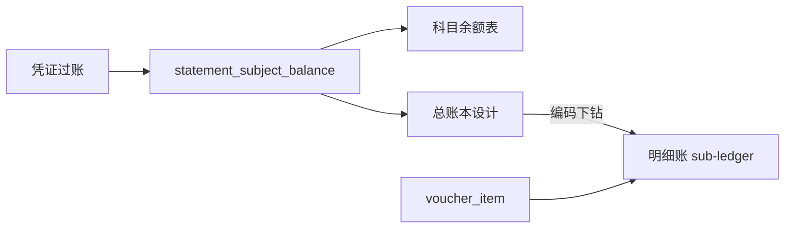

# 总账 — 设计说明

日期：2026-08-28  
状态：Phase 1 已实现（工作区未提交；菜单需执行 seed SQL）  
范围：jinbooks Phase 1 — 汇总型总账（每科目三行）+ 过滤 + 下钻明细账 + 导出

## 一、已确认决策

| # | 项 | 选择 |
|---|-----|------|
| 1 | 形态 | **汇总型总账**：每科目「期初余额 / 本期合计 / 本年累计」三行；**不含**凭证级流水 |
| 2 | 下钻 | 科目编码跳转现有明细账 `/voucher/sub-ledger`（带 `subjectCode` + 期间） |
| 3 | 跨期展行 | **区间折叠为一组**：每科目始终最多三行（非按月展开） |
| 4 | 期间列 | 单期显示该期（如 `202312`）；跨期显示**结束期** |
| 5 | 科目范围 | **默认仅一级**（`maxLevel=1`）；可改至二级/三级/末级；父级金额为下属汇总 |
| 6 | 默认隐藏 | 「无发生额且余额为0不显示」**默认勾选** |
| 7 | 取数 | **本期/本年累计**：已过账 `voucher_item` 实时汇总；**期初**：区间首月结转快照 opening |
| 8 | 币别 | **不做**（单本位币） |
| 9 | 未过账 | 不纳入（`postedOnly=true`，`sender_id` 非空） |
| 10 | 试算 | 返回本期借贷合计、期末余额借贷合计及是否平衡；不平衡写入 warnings |
| 11 | 实现路径 | `StatementGeneralLedgerService` 凭证汇总 + 期初结转 + 公式算期末 |
| 12 | 菜单位置 | 财务报表下「总账」，路径 `/statement/general-ledger` |
| 13 | 导出 | Excel（扁平行） |

## 二、背景与目标

### 2.1 背景

jinbooks 已有**科目余额表**（横向期初/本期/本年累计/期末借贷列）与**明细账**（逐笔凭证），缺少中间层的**总账**账簿视图：按科目竖排摘要行、便于查阅与打印习惯对齐的云财务总账样式。

### 2.2 目标

1. 新增 **总账** 页面，支持会计期间区间查询  
2. 每个科目一组三行（可因过滤变为一行），编码/名称单元格合并  
3. 过滤：起止科目、级次、辅助核算、三类显示开关  
4. 编码下钻明细账；支持 Excel 导出  

### 2.3 非目标（Phase 1）

- 总账内嵌凭证分录流水（经典账页逐笔）  
- 多币别 / 综合本位币切换  
- 打印模板、图表  
- 改造现有科目余额表 UI  
- 未过账凭证纳入总账  

---

## 三、报表结构

### 3.1 顶栏

| 控件 | 说明 |
|------|------|
| 期间 | 月份区间，展示如 `2023年12期 ~ 2023年12期`；`periodType=between`，`dateRange=[start,end]`（`yyyy-MM`） |
| 过滤 | Popover 面板（见 3.3） |
| 刷新 | 按当前条件重新查询 |

账期可选范围：账套 `termStart`～`termCurrent`（与科目余额表一致）。

### 3.2 主表列

```
| 科目编码 | 科目名称 | 期间   | 摘要     | 借方 | 贷方 | 方向 | 余额 |
|----------|----------|--------|----------|------|------|------|------|
| 1001     | 库存现金 | 202312 | 期初余额 |      |      | 借   | …    |
|          |          | 202312 | 本期合计 | …    | …    | 借   | …    |
|          |          | 202312 | 本年累计 | …    | …    | 借   | …    |
```

- 金额：千分位、两位小数；空值不显示 `0.00`（与参考产品一致处：无金额单元格留空）  
- 底栏：`共 N 条`，**N = 科目组数**（非展开后物理行数）  
- 编码为链接样式，点击下钻  

### 3.3 过滤面板

| 字段 | 类型 | 默认 | 说明 |
|------|------|------|------|
| 起始科目 | code | 空 | 编码/名称选择；空=不限制下界 |
| 结束科目 | code | 空 | 空=不限制上界；与起始构成闭区间 |
| 科目级次 | int | `0`（至末级） | `1`=仅一级；`2`=至二级…；`0`=至末级 |
| 显示辅助核算 | bool | `false` | `true` 时展开辅助核算余额行 |
| 余额为0不显示 | bool | `false` | 期末余额为 0 → 整组不出 |
| 无发生额且余额为0不显示 | bool | **`true`** | 区间本期借贷均为 0 **且** 期末余额为 0 → 整组不出 |
| 无发生额不显示本期合计、本年累计 | bool | `false` | 本期发生为 0 时只保留「期初余额」行（rowspan=1） |

无「币别」项。

隐藏规则优先级：整组不出（余额为0 / 无发生且余额为0）**优先于**「仅隐藏本期与本年累计行」。

---

## 四、计算逻辑

### 4.1 数据源

- 表：`statement_subject_balance`（`bookId` + `yearPeriod` + `subjectCode`）  
- 仅已过账结果；与 [`StatementReportService.subjectBalance`](financial-cloud/src/main/java/com/financial/cloud/service/statement/StatementReportService.java) 同源  
- 科目元数据：`book_subject`（`code`、`name`、`direction`、`level`、`parentId`）  

### 4.2 区间折叠（每个科目一条逻辑余额）

设区间月份列表 `months = getAllMonths()`，`first = months[0]`，`last = months[last]`。

| 摘要行 | 借方 / 贷方 | 方向 / 余额 |
|--------|-------------|-------------|
| 期初余额 | **借方、贷方列留空**（`null`） | 取 `first` 期初净额，按科目 `direction` 显示 `借`/`贷` 与余额；净额为 0 时方向为 `平`、余额列留空 |
| 本期合计 | `sum(currentPeriodDebit/Credit)` over `months`；均为 0 则留空 | 用「期初 + 本期」按科目方向重算余额（须与末月期末勾稽） |
| 本年累计 | 取 `last` 的 `yearToDateDebit/Credit`；均为 0 则留空 | 用 YTD 借贷按科目方向计算余额 |

**期间列取值**：`last` 对应的期间码（`yyyyMM`，如 `202312`）。

**勾稽**：同账套、同 `dateRange`、同科目（同级次口径下），总账「期初 / 本期合计 / 本年累计」借贷与科目余额表对应列一致，容差 **0.01**。

### 4.3 级次与父级

- 输出科目集合：`level <= maxLevel`（`maxLevel=0` 视为不限制，含末级）  
- 父级金额：优先使用快照中已汇总的父级行；若缺失则按子级 rollup  
- 辅助核算行：仅当 `showAux=true`，编码/名称拼接规则与科目余额表一致（如 `code_辅助码`）  

### 4.4 行展开规则

对每个通过过滤的科目：

1. 若触发整组隐藏 → 不输出  
2. 若「无发生额不显示本期合计、本年累计」且本期借贷合计均为 0 → 仅输出期初余额 1 行  
3. 否则输出 3 行，编码/名称 `rowSpan=3`（或 1）  

摘要文案固定：`期初余额`、`本期合计`、`本年累计`。

---

## 五、API 与模块

### 5.1 端点

| 方法 | 路径 | 说明 |
|------|------|------|
| GET | `/api/statement/general-ledger` | 查询 |
| GET | `/api/statement/general-ledger/export` | Excel 导出 |

挂载于现有 `StatementReportController`（`/api/statement`）。

### 5.2 请求参数

扩展现有 `StatementParamsDto`（与费用明细同一入参风格），新增字段如下：

| 参数 | 说明 |
|------|------|
| `bookId` | 必填（可由会话注入） |
| `periodType` | `between` |
| `dateRange` | `[startMonth, endMonth]`，`yyyy-MM` |
| `subjectCodeFrom` / `subjectCodeTo` | 起止科目编码（闭区间） |
| `maxLevel` | 见上 |
| `showAux` | 见上 |
| `hideZeroBalance` | 余额为0不显示 |
| `hideNoActivityAndZeroBalance` | 无发生额且余额为0不显示（默认 true） |
| `hidePeriodRowsWhenNoActivity` | 无发生额不显示本期合计、本年累计 |

### 5.3 响应

```text
StatementGeneralLedgerReport
  items: List<StatementGeneralLedgerItem>
  subjectCount: int          // 底栏「共 N 条」

StatementGeneralLedgerItem
  subjectCode, subjectName
  period                     // yyyyMM
  summary                    // 期初余额 | 本期合计 | 本年累计
  debit, credit              // BigDecimal，可为 null 表示留空
  direction                  // 借 | 贷 | 平
  balance
  groupKey                   // 合并用，通常 subjectCode（辅助行含辅助码）
  rowSpan                    // 组首行 = 本组行数（1 或 3），同组后续行 = 0；前端 span-method 直接使用
```

### 5.4 前端文件

| 文件 | 作用 |
|------|------|
| `financial-cloud-ui/src/views/statement/general-ledger.vue` | 页面 |
| `financial-cloud-ui/src/api/statement/statement-general-ledger.ts` | API |
| `sql/seed/general_ledger_menu.sql` | 菜单 + 管理员权限（仿 `expense_detail_menu.sql`） |

交互要点：

- `el-table` + `span-method` 合并科目编码、科目名称  
- 过滤 Popover：重置 / 查询  
- 编码点击：`router.push({ path: '/voucher/sub-ledger', query: { subjectCode, ...期间 } })`  

### 5.5 后端文件

| 文件 | 作用 |
|------|------|
| `StatementGeneralLedgerService` | 取快照、折叠、过滤、整形 |
| `StatementGeneralLedgerRules` | 纯函数：折叠、隐藏、方向余额（便于单测） |
| DTO：`StatementGeneralLedgerReport` / `Item` | 响应 |
| `StatementReportController` | 端点 |
| 消息与错误码 | 按需补充校验文案 |
| 单测 | Rules + Service（折叠、隐藏、级次、勾稽样例） |

### 5.6 导出

- EasyExcel 程序化写入；列与界面一致  
- 合并单元格可选；最低要求扁平行重复写编码/名称即可  

---

## 六、与现有功能关系



- 总账与科目余额表：**同一快照、不同排版**  
- 总账与明细账：总账汇总 → 明细账逐笔  

---

## 七、测试要点

1. 单期：三行数据与科目余额表同科目列一致（容差 0.01）  
2. 跨期：本期=各月本期之和；本年累计=末日 YTD；期初=首月期初  
3. `maxLevel=1` 仅一级父级；父级金额为下属汇总  
4. 默认「无发生且余额为0」隐藏空科目  
5. 「无发生不显示本期/本年」时 rowspan=1 仅期初  
6. 编码跳转明细账带上科目与期间  
7. 导出列与查询结果一致  

---

## 八、实现顺序（供后续 plan 引用）

1. Rules 单测（红）→ 实现折叠与隐藏规则（绿）  
2. Service + Controller + DTO  
3. 前端页面 + API + 过滤 Popover + span-method  
4. 下钻联调  
5. 导出 + 菜单 seed  
6. 与科目余额表勾稽回归  

---

## 九、开放项（已拍板，无 TBD）

无。币别、逐笔流水、打印均明确为非目标。
